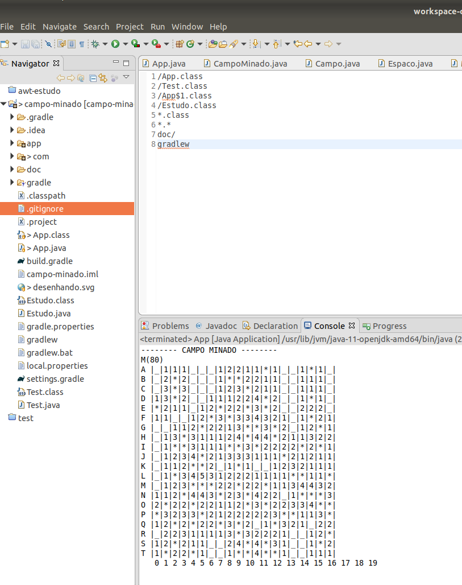

# Projeto Minas 

Este projeto tem como intuito a prática da linguagem JAVA. A lógica está saindo
mas a parte visual, está somente nas respostas do app por string.

Mas já dá para ver que a lógica está correta.

A ideia é desenvolver uma versão do jogo, mobile (javaa web), (android) e desktop. 
Não utilizarei outra linguagem para backend no projeto.

